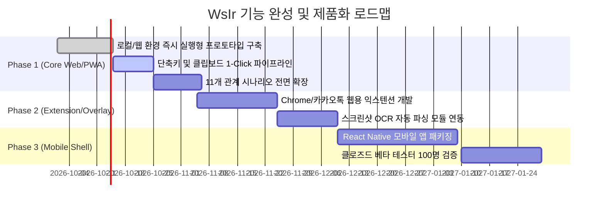

# 프로젝트 정체성 및 전략 마스터 문서 (Project Identity & Strategy)

> **프로젝트명**: 나 뭐라고 보낼까? (WsIr / What Should I Reply?)  
> **태그라인**: "AI가 답장의 톤까지 골라준다 — 고맥락 한국어 커뮤니케이션 코-파일럿"  
> **문서 버전**: v1.0 (2026.09 기준)  
> **상태**: 승인 및 실행 단계 (Approved & Active)

---

## 1. 프로젝트 정체성 및 비전 (Project Identity & Vision)

### 1.1 프로젝트 본질 (Project Essence)
* **정의**: 단순한 텍스트 생성기(Generator)가 아닌, 고맥락(High-Context) 한국어 메신저 환경에서 발생하는 미묘한 감정 소모, 의사소통 오해, 사회적 관계 위계를 조율하는 **"인터랙티브 관계 의사소통 코-파일럿(Communication Co-Pilot)"**.
* **핵심 미션**: 상대방의 메시지 이면에 숨겨진 의도(Intent)와 결핍(Needs)을 1초 만에 해독하고, 11대 사회적 관계에 맞춘 3가지 톤 후보와 한 수 앞선 **⚡ Wow Point(전략적 통찰 답장)**를 제공함으로써 불필요한 사회적 감정 비용을 제로화하는 것.
* **서비스 철학**:
  1. **User Value First**: 현학적인 기술 자랑이 아닌, 즉시 복사하여 카카오톡에 전송할 수 있는 1~2줄의 현실적 해결책 제시.
  2. **Zero-Knowledge Privacy**: 메신저 대화는 개인의 가장 은밀한 사생활이자 자산이므로, 서버 비저장(Zero Data Retention) 및 로컬 암호화(BYOK)를 고수.
  3. **Recursive Evolution**: AI가 사용자를 일방적으로 가르치는 것이 아니라, 사용자의 편집 흔적(Diff)을 학습하여 시간이 흐를수록 "나다운 말투"로 동기화.

---

## 2. 경쟁 환경 심층 분석 및 시장 공백 (Competitive Landscape & Whitespace)

현재 시장의 솔루션은 크게 네 가지 세그먼트로 나뉘며, 각 세그먼트는 치명적인 한계점을 지니고 있습니다.

```
┌────────────────────────────────────────────────────────────────────────────────────────┐
│                              시장 포지셔닝 맵 (Positioning Map)                        │
│                                                                                        │
│      [심층 맥락 분석 & 전략 코칭]                                                      │
│                   ▲                                                                    │
│                   │                     ★ 나 뭐라고 보낼까? (WsIr)                     │
│                   │                     (상대 의도 해독 + Wow Point + 재귀 학습)        │
│                   │                                                                    │
│                   │                                                                    │
│  [글로벌 데이팅 AI]│                   [국내 니즈 챗봇/앱]                            │
│  (Rizz, Plug AI)  │                   (대필이, 답장고수, 답대리)                       │
│  - 서구식 연애 특화│                   - 단순 프롬프트 래퍼                             │
│  - 단순 스크린샷  │                   - 재귀 학습 부재 / 뻔한 답변                    │
│  ─────────────────┼────────────────────────────────────────► [한국 문화 적합도 & 위계]│
│                   │                                                                    │
│                   │   [플랫폼/OS 내장형]              [메신저 통합 에이전트]           │
│                   │   (갤럭시 AI, 애플 인텔리전스)    (카카오 카나나)                  │
│                   │   - 문장 단순 변환(Rewrite)        - 일정/요약/선톡 중심            │
│                   │   - 상대방 메시지 분석 불가        - 대화 조율/답장 코칭 공백       │
│                   ▼                                                                    │
│      [단순 문체 변환 / 요약]                                                           │
└────────────────────────────────────────────────────────────────────────────────────────┘
```

### 2.1 세그먼트별 경쟁 분석 (Detailed Competitor Breakdown)

| 구분 | 주요 플레이어 | 핵심 기능 | 치명적 결함 및 한계점 |
|---|---|---|---|
| **1. 글로벌 데이팅/메신저 AI** | Rizz AI, Plug AI, Wingman Live | 틴더/힌지 스크린샷 기반 위트 있는 작업 멘트, 유혹적 답장 생성 | • 서구권 연애 문화에 매몰되어 직장/비즈니스/가족 커뮤니케이션 적용 불가<br>• 한국어 경어체(합쇼체/해요체) 및 문화 코드(ㅋㅋ, ㅠㅠ) 미반영<br>• "뻔한 복붙 앱"이라는 피로도 및 틴더 등 플랫폼의 자체 차단 리스크 |
| **2. OS/디바이스 내장 어시스트** | 삼성 갤럭시 AI (대화 어시스트), Apple Intelligence (Writing Tools) | 삼성 키보드 내 전문적/공손한/소셜 톤 변환, 맞춤법 교정 | • **수동 Rewrite 전제**: 사용자가 이미 초안을 작성해야만 작동함<br>• **상대방 메시지 맥락 해독 불가**: 상대가 무슨 의도로 보냈는지 분석하지 못함<br>• **전략적 통찰 부재**: 상황을 주도할 수 있는 대안(Wow Point) 제시 불가 |
| **3. 국내 1세대 텍스트 생성 앱** | 대필이, 답장고수, 답대리, 톡비서 | 대화 캡처/입력 시 상황별(거절/사과/연애) 3가지 답장 출력 | • **단순 LLM 프롬프트 래퍼**: 개인화 학습 엔진이 없어 매번 평이한 답변 반복<br>• **유닛 이코노믹스 붕괴**: 단일 고비용 모델 호출로 인해 3~5회 무료 후 과도한 과금 유도<br>• **심리학/커뮤니케이션 프레임워크 부재**: 단순 텍스트 나열에 불과 |
| **4. 플랫폼 거대 AI 메이트** | 카카오 카나나 (Kanana) | 1:1 메이트(나나), 단톡 메이트(카나) 기반 일정 요약, 선톡, 정보 검색 | • **사생활 보호 한계**: 민감한 대인 갈등이나 연애 고민을 카카오 메인 플랫폼에 맡기기 꺼려짐<br>• **비서 기능에 집중**: 답장 작성의 심리적 갈등 해결보다는 일정/요약/검색에 초점 |

### 2.2 시장 공백 (The Whitespace)
* **공백 영역**: **"상대방의 숨겨진 서브텍스트를 해독하고, 한국적 11대 관계 위계를 고려해, 쓰면 쓸수록 내 말투로 수렴하며, 1회 호출당 ₩11로 운영 가능한 지능형 코-파일럿"**은 현재 시장에 전무합니다.

---

## 3. 타깃 사용자 정의 및 페르소나 (Target Users & Personas)

### 3.1 핵심 타깃 세그먼트 (Primary & Secondary Targets)

1. **Primary Target: 사회초년생 및 직장인 (25~35세)**
   * **특징**: 카카오톡, 사내 메신저(슬랙, 잔디)로 상사, 선배, 타 부서와의 커뮤니케이션이 잦음.
   * **핵심 고통(Pain Point)**: "이거 언제까지 가능해?", "확인 부탁드립니다" 같은 압박/모호한 메시지에 잘못 답했다가 찍힐까 봐 10분 넘게 답장을 썼다 지웠다 반복함.
   * **니즈**: 결론 우선, 기한 명시, 완충 어휘가 들어간 결점 없는 정중체 + 상사를 안심시키는 주도적 솔루션.

2. **Secondary Target: 고감도 대인관계 관리자 / 썸·연인 관계 (20~30대 남녀)**
   * **특징**: 이성 관계에서 상대방의 단답이나 침묵("응", "주말에 시간 돼?", "ㅋㅋ 괜찮아")의 뉘앙스를 해석하는 데 과도한 에너지를 소모함.
   * **핵심 고통(Pain Point)**: 상대방의 감정선을 놓치거나 너무 쿨하게/집착하듯 답해 관계를 망치는 것에 대한 불안.
   * **니즈**: 상대의 결핍된 욕구를 긁어주면서도 내 자존감을 지키는 센스 있는 Wow Point 답장.

3. **Tertiary Target: 프리랜서 및 대고객 커뮤니케이션 담당자**
   * **특징**: 무리한 요구, 불만 제기, 대금 지연 등 민감한 비즈니스 협상을 카톡/문자로 처리해야 함.
   * **핵심 고통(Pain Point)**: 감정적인 충돌을 피하면서도 단호하게 선을 긋는 비즈니스 협상 어휘 부족.

---

## 4. 핵심 차별화 요소 및 기술적 해자 (Key Differentiators & Technical Moats)

```
┌────────────────────────────────────────────────────────────────────────┐
│                    WsIr의 5대 구조적 기술 해자 (Moats)                 │
├─────────────────────┬──────────────────────────────────────────────────┤
│ 1. ⚡ Wow Point      │ 상대의 결핍 욕구를 역이용하는 전략적 휴리스틱 엔진 │
├─────────────────────┼──────────────────────────────────────────────────┤
│ 2. 11대 관계 위계학  │ 한국어 화용론(Pragmatics)을 반영한 프롬프트 아키텍처│
├─────────────────────┼──────────────────────────────────────────────────┤
│ 3. LCS 재귀 적응    │ 클라이언트 온디바이스 Diff 추출 + 0.85 감쇄 프로파일링│
├─────────────────────┼──────────────────────────────────────────────────┤
│ 4. Multi-Model 라우팅│ 80% Mini + 20% 4o + 24h 캐싱 = 94% 비용 절감 (₩11)  │
├─────────────────────┼──────────────────────────────────────────────────┤
│ 5. Zero-Storage BYOK│ 서버 비저장 로컬 암호화로 엔터프라이즈급 신뢰성 확보  │
└─────────────────────┴──────────────────────────────────────────────────┘
```

### 해자 1: ⚡ Wow Point 시스템 (상대 심리 역전 엔진)
* **메커니즘**: 단순 키워드 치환이 아닌, `[의도] → [표면 감정 vs 이면 감정] → [결핍된 욕구] → [선제적 해결책 제시]`의 4단계 추론 체인(Chain-of-Thought)을 거쳐 Gemini 2.5 Flash를 통해 생성.
* **차별점**: 일반적인 "수동적 수락/사과"가 아닌, 상대방이 미처 인지하지 못한 일정 조율이나 감정적 배려를 선제 제시하여 사용자를 "일 잘하고 센스 있는 사람"으로 포지셔닝.

### 해자 2: 한국형 11대 화용론(Pragmatics) 아키텍처
* 한국어 특유의 경어법 체계(존칭 접미사, 합쇼체/해요체/해체 분기, 완곡어법, 쿠션어)를 11개 관계 모델에 정밀 매핑.
* 관계별 금기어(Red Flags)와 권장 어휘(Preferred Lexicon)를 필터링하여 사회적 실수를 원천 차단.

### 해자 3: LCS Diff 기반 온디바이스 재귀 학습 (Data Moat)
* 사용자가 AI 추천 답장을 1글자라도 수정할 때마다 최장 공통 부분 수열(LCS) 알고리즘으로 즉각적인 피드백 루프 생성.
* **시간 가중 감쇄(Exponential Decay 0.85)** 공식:
  $$\text{Bias}_{t} = \text{Bias}_{t-1} \times 0.85 + \Delta_{\text{current}} \times 0.15$$
* 이 데이터는 사용자의 디바이스에 누적되어, 경쟁사가 모델 성능을 높여도 **"내 말투를 가장 잘 아는 유일한 서비스"**라는 대체 불가능한 락인(Lock-in) 효과 발생.

### 해자 4: Multi-Model Routing & 비용 최적화 (Economic Moat)
* **비용 절감 94% 달성**:
  * 의도 분석(Layer 1), 기본 3개 초안(Layer 2), 정렬(Layer 4) → `Gemini 2.5 Flash Lite`
  * 킬러 피처인 Wow Point(Layer 3) → `Gemini 2.5 Flash`
  * 24시간 TTL 로컬 해시 캐싱 (동일 맥락 재호출 시 0원, 0ms)
* **결과**: 세션당 비용을 ₩183에서 ₩11로 낮춤으로써, 경쟁사들이 API 비용 감당을 못하고 무너질 때 월 ₩4,900 구독 모델로도 7,186명만으로 손익분기점(BEP)을 돌파하는 경제적 해자 구축.

### 해자 5: Zero-Data Retention & BYOK 신뢰성 (Trust Moat)
* 사용자의 카카오톡 대화 내용과 Google Gemini API Key는 클라이언트(로컬 저장소/OS 보안 키체인)에만 저장.
* 서버는 사용자 대화 원문을 단 1바이트도 수집하지 않으므로 개인정보보호법 및 망분리 규제로부터 자유롭고 사용자 신뢰 극대화.

---

## 5. 기능 수준 프로토타입 구현 계획 (Implementation Plan)

현재 웹 기반 프로토타입([Engine v5 Live](https://tpwkujhv18eih.space.minimax.io/))을 바탕으로, 실제 사용자가 데일리 메신저 환경에서 직접 활용 가능한 **기능 수준(Functional Level) 제품**으로 전환하기 위한 구체적 실행 계획입니다.

### 5.1 단계별 마일스톤 및 로드맵



### 5.2 상세 구현 테스크 (Actionable Tasks)

#### Task 1: 독립 실행형 기능 웹/PWA 엔진 배포 (현 단계 최우선)
* **목표**: 별도의 빌드 도구 없이 브라우저나 데스크톱에서 카카오톡 PC버전과 나란히 띄워놓고 즉시 쓸 수 있는 고속 작업 환경 완성.
* **기능 요건**:
  1. 클립보드 자동 감지: 카톡에서 복사한 텍스트를 포커스 즉시 입력창에 자동 삽입.
  2. 1-Click 원터치 복사: 생성된 추천 카드 클릭 시 클립보드 복사 및 완료 토스트.
  3. 11개 관계 프리셋 선택 UI: 직장, 연인, 친구 등 탭 전환을 통한 즉시 모드 변경.
  4. 로컬 스토리지 기반 프로필 영속화 및 백업/복원(JSON Import/Export) 기능.

#### Task 2: 웹 익스텐션 & 오버레이 연동 (Phase 2)
* **목표**: 카카오톡 웹, 슬랙 웹, 인스타그램 DM 화면 우측 하단에 플로팅 위젯 형태로 상주.
* **기능 요건**:
  1. DOM 기반 수신 메시지 실시간 캡처.
  2. 플로팅 UI에서 4개 답장 추천 후 클릭 시 입력창에 자동 타이핑(Input Injection).

#### Task 3: 크로스플랫폼 모바일 앱 (Phase 3)
* **목표**: React Native 기반 모바일 앱으로 패키징하여 Android/iOS 실기기 배포.
* **기능 요건**:
  1. Android: 접근성 서비스(Accessibility)를 활용한 카톡 화면 위 플로팅 버블.
  2. iOS: 공유 시트(Share Extension) 및 커스텀 키보드 익스텐션 연동.

---

## 6. 결론 및 향후 방향성 (Executive Conclusion)

'나 뭐라고 보낼까? (WsIr)'는 **"뻔한 답변을 생성하는 또 하나의 AI 챗봇"**이 아닙니다.  
한국인의 사회적 관계 역학을 가장 정확하게 꿰뚫어 보는 **"사회심리학적 인터페이스"**이자, 사용자 고유의 화법을 학습하는 **"초개인화 화용론 엔진"**입니다.

검증된 Engine v5 아키텍처를 바탕으로 실사용자 피드백 루프를 조기에 완성하여, 한국어 메신저 AI 커뮤니케이션 시장의 독보적인 카테고리 킹(Category King)으로 도약할 것입니다.
