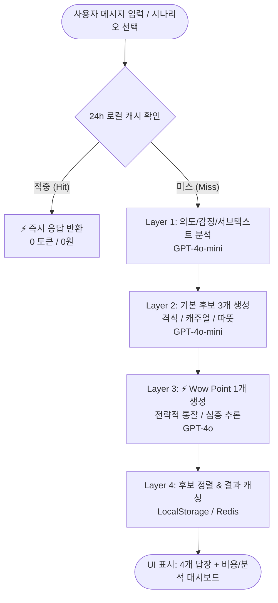

# 나 뭐라고 보낼까? (WsIr) 💬
> **"AI가 답장의 톤까지 골라준다"**  
> 고맥락 한국어 메신저 환경을 위한 맞춤형 AI 커뮤니케이션 코-파일럿 (Communication Co-Pilot)

[](https://tpwkujhv18eih.space.minimax.io/)
[](https://github.com/489156/WsIr)
[-7C9EFF?style=for-the-badge&logo=openai&logoColor=white)](https://platform.openai.com/)
[]()

---

## Executive Summary (핵심 요약)

**'나 뭐라고 보낼까? (WsIr)'**는 카카오톡, 슬랙, 문자 메시지 등 일상과 업무 메신저 대화에서 발생하는 감정 소모, 의사소통 오해, 답장 스트레스를 해결하기 위해 기획된 **지능형 메신저 답장 추천 및 관계 코칭 서비스**입니다.

단순히 뻔한 문장을 기계적으로 생성하는 기존 AI 챗봇과 달리:
1. **상대방 메시지의 이면(의도, 감정, 서브텍스트, 숨겨진 니즈)**을 정밀 해독합니다.
2. **한국 특유의 11개 사회적 관계 위계(상사, 선배, 클라이언트, 연인 등)**에 최적화된 3가지 톤(격식/캐주얼/따뜻) 후보를 즉시 생성합니다.
3. 상대방의 기대를 뛰어넘는 전략적 통찰을 담은 **⚡ Wow Point 답장 1개**를 제공합니다.
4. 사용자 편집 피드백을 실시간 수집하는 **LCS diff 기반 재귀 자기개선 엔진**을 통해, 쓸수록 사용자 고유의 어조와 선호 스타일로 진화합니다.
5. **Multi-Model Routing(GPT-4o-mini 80% + GPT-4o 20%)과 24시간 캐싱**을 통해 고성능을 유지하면서 호출 비용을 **94% 절감(세션당 약 ₩11)**하여 지속 가능한 유닛 이코노믹스를 달성했습니다.

---

## 1. 프로젝트 기획 의도 및 배경 (Background & Intent)

### 1.1 해결하고자 하는 문제 (Problem Statement)
* **한국어의 고맥락(High-Context) 문화**: 한국어 메신저 대화는 텍스트 그대로의 의미보다 문맥, 이모티콘(ㅋㅋ, ㅠㅠ), 문장 부호(~, .), 호칭, 답장 간격에 따라 완전히 다른 의미를 가집니다.
  * 예: *"ㅋㅋ 괜찮아"* → 표면적 용서 vs 내면의 서운함
  * 예: *"확인해보겠습니다"* → 업무 검토 vs 완곡한 회피/거절
* **세분화된 사회적 관계와 경어체 피로도**: 격식체(합쇼체), 친근한 존댓말(해요체), 반말(해체) 등 상대방의 나이, 직급, 친밀도에 따라 잘못된 톤 하나가 관계를 위태롭게 만듭니다.
* **범용 AI의 한계**: ChatGPT 등 기존 범용 LLM은 장황하고 어색한 번역투 문장을 출력하며, 메신저 대화에 즉시 복사해 붙여넣을 수 있는 '1~2줄 압축 한국어 메신저 문체'를 구현하지 못합니다.
* **프라이버시 우려**: 민감한 사생활이나 비즈니스 대화 내용이 서버 데이터베이스에 무단 저장되거나 유출되는 것에 대한 거부감이 큽니다.

### 1.2 서비스의 핵심 목표 (Mission & Solution)
* **1초 의사결정**: 상대방 메시지 캡처/입력 즉시 4개 답장 후보와 전략 가이드를 제공하여 고민 시간을 5분에서 10초 이내로 단축.
* **관계의 질적 개선 (Communication Coaching)**: 단순 도구를 넘어 상대의 심리와 욕구를 짚어주는 미묘한 심리학적 통찰(Layered Brain Science) 제공.
* **프라이버시 최우선 (Zero Data Retention)**: API Key와 대화 원문은 사용자 기기(로컬)에만 머무르는 BYOK(Bring Your Own Key) 아키텍처 지향.

---

## 2. 핵심 차별화 요소 (Core Differentiators)

```
┌────────────────────────────────────────────────────────────────────────┐
│                        나 뭐라고 보낼까? 5대 핵심 가치                  │
├─────────────────────┬──────────────────────────────────────────────────┤
│ ⚡ Wow Point         │ 사용자가 미처 생각지 못한 한 수 앞선 전략적 통찰답장│
├─────────────────────┼──────────────────────────────────────────────────┤
│ 👥 11개 관계 카테고리│ 상사/동료/선배/후배/교수/클라이언트/연인/친구 등 특화│
├─────────────────────┼──────────────────────────────────────────────────┤
│ 🧠 재귀 자기개선     │ 사용자 수정본 diff 분석 → 내 말투로 자동 프로파일링  │
├─────────────────────┼──────────────────────────────────────────────────┤
│ 💸 Multi-Model 라우팅│ mini(80%) + 4o(20%) + 캐싱 → ₩11/세션 (94% 비용 절감)│
├─────────────────────┼──────────────────────────────────────────────────┤
│ 🔒 철저한 프라이버시 │ 대화 원문 서버 비저장 + BYOK 로컬 암호화 저장         │
└─────────────────────┴──────────────────────────────────────────────────┘
```

### 1) ⚡ Wow Point: "사용자가 절대 생각하지 못한 각도"
기존 답장 추천기는 "네 알겠습니다"나 "시간 괜찮아요"처럼 누구나 생각할 수 있는 평범한 답변을 제시합니다. 반면 **Wow Point**는 상대의 숨겨진 불안이나 욕구를 먼저 배려하면서 주도권을 잃지 않는 통찰을 담습니다.
* **상황 (상사 압박)**: *"이거 언제까지 가능해? 클라이언트에서 빨리 답변 달라고 하는데"*
  * ❌ *일반 답변*: "내일 오전까지 하겠습니다."
  * ⚡ *Wow Point*: **"오늘 밤 11시까지 핵심 초안 먼저 넘겨드리고, 내일 오전 클라이언트 출근 전 피드백 반영해 최종본 올리겠습니다. 가장 급한 항목부터 말씀해 주시면 우선순위 두고 먼저 잡겠습니다."** (일정 확답 + 주도적 해결책 + 팀장 안심 유도)

### 2) 한국형 11대 관계 카테고리 (Speech Levels & Nuance)
| 대분류 | 카테고리 | 호칭 및 권장 톤 | 핵심 전략 |
|---|---|---|---|
| **직장 / 비즈니스** | 상사 (`boss`) | 팀장님, 과장님 등 / 합쇼체 | 결론 우선, 기한 명시, 완충 표현 사용 |
| | 선배 (`senior`) | 선배님 / 부드러운 존댓말 | 존중과 친근함의 균형, 감사의 표시 |
| | 동료 (`colleague`) | 님 / 해요체 | 상호 존중, 명확한 협업 요청 |
| | 후배 (`junior`) | 이름 / 멘토링 톤 | 정중한 배려, 심리적 안정감 제공 |
| | 클라이언트 (`client`) | 고객사 직함 / 비즈니스 격식 | 신뢰성 확보, 모호성 배제, 신속한 확인 |
| **학업 / 공적** | 교수님 (`professor`) | 교수님 / 최고 수준 합쇼체 | 예의, 학술적 명확성, 일정 확인 |
| | 학교 친구 (`school`) | 너, 이름 / 반말·해요체 | 편안함, 공감 표현 |
| **사적 / 가족** | 연인 (`romantic`) | 애칭, 너 / 다정·배려 톤 | 감정 교감, 뉘앙스 포착, 선제적 제안 |
| | 부모님 (`parent`) | 엄마, 아빠 / 따뜻한 존댓말 | 안부 확인, 그리움 충족, 감사 표현 |
| | 형제자매 (`sibling`) | 형, 누나, 너 / 직설적 캐주얼 | 간결성, 실용성 |
| | 친구 (`friend`) | 야, 너 / 한국 메신저 코드(ㅋㅋ, ㅠㅠ) | 유대감 확인, 서운함 해소 |

### 3) LCS Diff 기반 재귀 학습 (Recursive Learning Engine)
사용자가 AI 추천 문구를 그대로 복사하지 않고 인라인 모달에서 편집할 경우, **최장 공통 부분 수열(LCS, Longest Common Subsequence)** 알고리즘을 구동합니다.
* 사용자가 추가한 표현(`diff.added`)과 삭제한 표현(`diff.removed`)을 2~8자 단위로 토큰화.
* 문체 격식도 이동량(`computeFormalityShift`)과 길이 편향(`computeLengthShift`)을 산출.
* **시간 가중 감쇄 모델(Decay 0.85)**을 적용하여 최신 수정 성향을 관계별 프로필에 반영:
  $$\text{Bias}_{\text{new}} = \text{Bias}_{\text{old}} \times 0.85 + \text{Shift} \times 0.15$$
* 3회 이상 피드백이 쌓인 관계는 다음 추천 시 프롬프트 주입(Few-shot Context Injection)을 통해 "진짜 나다운 어투"를 자동 합성.

---

## 3. Multi-Model Routing & 비용 최적화 (Architecture)

### 3.1 처리 파이프라인
단일 대형 모델(GPT-4o)을 전면 적용하면 세션당 약 ₩183의 비용이 발생하여 B2C 서비스로서 유닛 이코노믹스가 성립하지 않습니다. **WsIr Engine v5**는 작업을 역할별로 분할하여 최적 모델로 라우팅합니다.



### 3.2 비용 및 손익분기 (Cost Breakdown & Unit Economics)

| 항목 | 전면 GPT-4o (구 v4) | Multi-Model Routing (현 v5) | 절감 효과 |
|---|---|---|---|
| **Layer 1 (의도 분석)** | GPT-4o (~$0.015) | **GPT-4o-mini (~$0.0006)** | -96% |
| **Layer 2 (초안 3개)** | GPT-4o (~$0.045) | **GPT-4o-mini (~$0.0011)** | -97% |
| **Layer 3 (Wow Point)**| GPT-4o (~$0.075) | **GPT-4o (~$0.0066)** | 핵심만 집중 |
| **24h 캐싱 적중 시** | $0 | **$0** | 즉시 응답 |
| **세션당 실측 비용** | **약 ₩183 ($0.137)** | **약 ₩11 ($0.0083)** | **94% 절감** |
| **Plus 구독자 BEP** | 약 36,000명 필요 | **약 7,186명 달성 시 손익분기** | 현실적 사업성 확보 |

---

## 4. 라이브 프로토타입 (Engine v5 Live Prototype)

* **배포 URL**: [https://tpwkujhv18eih.space.minimax.io/](https://tpwkujhv18eih.space.minimax.io/)
* **상태**: Production-ready 웹 프로토타입 (MiniMax Agent 배포 환경)

### 4.1 프로토타입 주요 검증 기능
1. **BYOK 셋업 스크린**: 브라우저 로컬 저장소 기반 암호화 보관, 서버를 거치지 않는 투명한 키 관리.
2. **5대 실전 시나리오 제공**:
   * 💕 *연인 · 주말 약속*: `"주말에 시간 돼?"` — 모호한 질문에 대한 적극적 데이트 제안
   * 👔 *상사 · 보고서 마감*: `"이거 언제까지 가능해?"` — 마감 압박을 역이용하는 전략적 리포팅
   * 🤝 *친구 · 서운한 화해*: `"ㅋㅋ 괜찮아"` — 서운함을 털어내고 기분 상하지 않게 푸는 법
   * 👨‍👩‍👧 *가족 · 엄마 안부*: `"잘 지내지? 전화 한번 해줘"` — 부모님의 외로움을 덜어주는 따뜻한 답장
   * 💼 *클라이언트 · 미묘한 불만*: `"확인해보겠습니다"` — 지연·거절 신호를 방어하는 프로페셔널 대응
3. **Multi-Model 실시간 상태 추적기**: 캐시 확인 → Mini 의도 분석 → Mini 초안 3개 → 4o Wow Point 순차 파이프라인 시각화.
4. **실시간 비용/캐시 트래커**: 세션별 실시간 비용(₩), 누적 호출 수, 캐시 적중률(%) 실시간 카운팅.
5. **인라인 에디터 & Diff 시각화**: 메시지 수정 시 변경된 단어(+추가 / -삭제)를 시각적으로 하이라이트하고 즉시 프로필에 피드백.
6. **학습 프로필 대시보드**: 관계별 격식도 지수, 표본 수, 학습된 선호 표현 목록 모니터링.

---

## 5. Subtle Layered 커뮤니케이션 코칭 프레임워크

사용자에게 부담을 주지 않으면서 심리학/커뮤니케이션 과학적 가치를 단계적으로 전달하는 **Layered Approach**를 채택했습니다.

```
┌────────────────────────────────────────────────────────────────────────┐
│ [Layer 1] 무료 사용자 (기본 도구)                                       │
│  · 답장 후보 4개 추천 (기본 3개 + Wow Point 1개)                        │
│  · 서브텍스트 1줄 요약 ("상대방이 진짜 원하는 것")                     │
│  · 절대 쓰면 안 되는 회피 표현(Red Flags) 경고                         │
└────────────────────────────────────────────────────────────────────────┘
                                 ↓ (Plus 구독 시 전환: 월 ₩4,900)
┌────────────────────────────────────────────────────────────────────────┐
│ [Layer 2] Plus 구독자 (심화 관계 코칭)                                  │
│  · 심층 분석 패널 (의도, 감정, 상대방의 결핍 욕구, 추천 커뮤니케이션 전략) │
│  · 발신자-수신자 톤 불일치(Mismatch) 알림                              │
│  · 시간대별 톤 가이드 (출근 시간대, 퇴근 직후, 심야 시간대)             │
│  · 개인화 학습 데이터 시각화 (내가 자주 쓰는 표현 및 어조 변화 추이)    │
└────────────────────────────────────────────────────────────────────────┘
                                 ↓ (Pro / B2B 팀 플랜: 월 ₩14,900)
┌────────────────────────────────────────────────────────────────────────┐
│ [Layer 3] Pro & B2B (커뮤니케이션 이론 기반)                            │
│  · 사회심리학 이론 기반 수신자 톤 시뮬레이션 ("상대방이 이 글을 읽었을 때")│
│    (Erving Goffman의 체면 유지 이론, Brown & Levinson의 공손성 전략)   │
│  · B2B 기업 맞춤형 톤앤매너 가이드라인 준수율 점검                      │
│  · 조직 및 고객 응대 이력 분석 대시보드                                │
└────────────────────────────────────────────────────────────────────────┘
```

---

## 6. 기술 스택 및 시스템 명세 (Tech Stack)

### 6.1 프론트엔드 (Mobile Client)
* **Framework**: React Native (iOS 17+, Android 10+)
* **Styling**: NativeWind (Tailwind CSS for React Native)
* **Navigation**: React Navigation v6
* **State Management**: Zustand
* **Storage**:
  * 일반 설정/프로필/캐시: AsyncStorage
  * 민감 키(API Key): iOS Keychain / Android EncryptedSharedPreferences

### 6.2 백엔드 (Minimal Sync & IAP API)
* **Runtime**: Node.js + Fastify + TypeScript (I/O 병목 최소화)
* **Database**: PostgreSQL (Supabase Free Tier / Cloudflare D1 호환)
* **Session Cache**: Redis (Upstash)
* **결제 인프라**: StoreKit 2 (iOS) / Google Play Billing (Android) / 토스페이 (웹 폴백)
* **원칙**: 백엔드는 결제 검증, 프로필 동기화(선택적), 익명 통계만 처리하며 **대화 원문과 API Key는 절대 서버에 저장하지 않음**.

### 6.3 AI & LLM 엔진
* **Main Models**:
  * `gpt-4o-mini`: 고속 문맥 파싱, 3-Tier 초안 생성, 품질 점수화
  * `gpt-4o`: 고차원 전략적 추론, Wow Point 생성
* **Fallback / Multi-Vendor**: Claude 3.5 Sonnet 및 Gemini 1.5 Pro 추상화 인터페이스 구비

---

## 7. 사업 로드맵 (Milestones & Roadmap)

```
2026 Q1-Q2             2026 Q3                 2026 Q4                 2027 Q1
[Phase 0: Foundation] → [Phase 1: Closed Beta] → [Phase 2: Public MVP]   → [Phase 3: Integration]
· Fastify 백엔드 셋업   · 테스터 100명 검증     · 스토어 정식 출시      · 안드로이드 오버레이
· React Native 셸 구축  · 실사용 1,000건 축적   · Plus 인앱 결제 (₩4,900)· iOS 키보드 확장
· Multi-Model 라우팅    · D1 리텐션 ≥ 50%       · MAU 3,000 달성        · MAU 50,000 / B2B 런칭
```

* **Phase 0 — Foundation (M0 ~ M1)**: 백엔드 API 부트스트랩, React Native 셸 셋업, Engine v5 핵심 파이프라인 모바일 포팅.
* **Phase 1 — Closed Beta (M2 ~ M3)**: 100명 클로즈드 베타, 실사용 피드백 1,000건 수집, 세션당 비용 ₩15 이하 고정.
* **Phase 2 — Public MVP (M4 ~ M6)**: App Store / Google Play 공식 출시, Plus 구독(₩4,900/월) 런칭, MAU 3,000 / 결제 전환 3%.
* **Phase 3 — Messenger Integration (M7 ~ M9)**: 카카오톡 앱 위에서 바로 작동하는 Android 접근성 오버레이 및 iOS 키보드 익스텐션 배포, MAU 15,000 돌파.
* **Phase 4 — Intelligence Layer & Global (M10 ~ M12)**: 수신자 반응 예측, 일본 LINE 시장 진출, B2B 조직 커뮤니케이션 코칭 솔루션 확장.

---

## 8. 저장소 문서 구성 (Repository Structure)

```
WsIr/
├── README.md                     # 본 문서 (프로젝트 개요, 비전, 아키텍처 및 종합 가이드)
├── MASTER_PLAN v1 (1).1          # 사업/제품/엔지니어링 마스터 플랜 v1.1 (Foundational Blueprint)
└── VIBE_CODING_BLUEPRINT (1).md  # AI 코딩 에이전트용 구현 명세서 (Dense prompt spec for RN build)
```

* **[MASTER_PLAN v1 (1).1](./MASTER_PLAN%20v1%20(1).1)**: 창업자 비전, As-Is 자산 평가, 단계별 예산/팀 빌딩, KPI 대시보드, 리스크 매트릭스를 다룬 총괄 전략서입니다.
* **[VIBE_CODING_BLUEPRINT (1).md](./VIBE_CODING_BLUEPRINT%20(1).md)**: Minimax, Claude Code, Antigravity 등 AI 에이전트가 React Native 앱을 직접 빌드할 수 있도록 작성된 엄격한 머신 프롬프트 명세서입니다.

---

## 9. 기여 및 개발 참여 (Contribution & License)

본 프로젝트는 고품질 한국어 AI 커뮤니케이션 서비스 개발을 목표로 진행 중인 독점(Proprietary) 프로젝트입니다.
기여나 협업 문의는 저장소의 Issue 또는 PR을 통해 등록해 주시기 바랍니다.

* **저작권**: © 2026 "나 뭐라고 보낼까? (WsIr)" All Rights Reserved.
